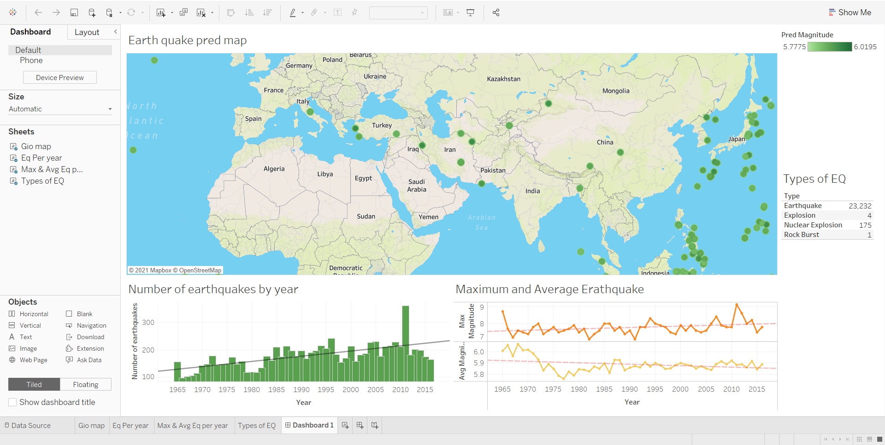

# Earthquake-Prediction

## 📦 requirements.txt
```bash
pyspark
pandas
numpy
matplotlib
seaborn
pymongo
notebook
```
---
## 📝 README.md
# 🌍 Earthquake Prediction using Big Data & Machine Learning

This project leverages Big Data technologies and Machine Learning algorithms to predict future earthquake trends based on historical seismic data. The workflow includes data ingestion using PySpark, transformation with Spark SQL, prediction with Spark MLlib, storage with MongoDB, and visualization using Tableau.

---

## 📸 Output Screenshots

### 🌐 Geo Map


### 📈 Earthquakes Per Year


### 📊 Max & Average Earthquakes Per Year


### 🌋 Types of Earthquakes


### 📊 Dashboard Overview


---

## 🛠️ Technologies Used

- 🐍 **PySpark** – For ETL (Extract, Transform, Load) operations
- 🤖 **Spark MLlib** – For machine learning and model training
- 📊 **Tableau** – For dashboards and interactive visualizations
- 🍃 **MongoDB** – For storing structured earthquake data

---

## 💻 Software Requirements

- Python 3.9+
- Jupyter Notebook
- MongoDB
- Apache Spark  
  📺 [Spark Setup Video](https://youtu.be/cYL42BBL3Fo)
- Tableau Desktop  
  📺 [MongoDB ODBC Setup](https://www.youtube.com/watch?v=ujyEgHJ2blc)

---

## 🚀 Getting Started

### Step 1: Clone the Repository

```bash
git clone https://github.com/yourusername/earthquake-prediction.git
cd earthquake-prediction
```
### Step 2: Install Python Dependencies
```bash
pip install -r requirements.txt
```
### Step 3: Start MongoDB Server

Ensure your MongoDB server is running locally on default port 27017.

## ⚙️ Run Spark with MongoDB Connector

In your terminal or command prompt, run:
```bash
pyspark \
  --conf "spark.mongodb.input.uri=mongodb://127.0.0.1/Quake.quakes?readPreference=primaryPreferred" \
  --conf "spark.mongodb.output.uri=mongodb://127.0.0.1/Quake.quakes" \
  --packages org.mongodb.spark:mongo-spark-connector_2.12:2.4.1
```
---
## 📒 Run the Notebook
  1. Launch Jupyter:
     ```bash
     jupyter notebook
     ```
  2. Open earthquake_prediction.ipynb.
  3. Run all cells in order.
---

## 📂 Output

After running the notebook:

    Your MongoDB will be populated with cleaned and structured earthquake data.
    You can then use Tableau to visualize and analyze trends using the connected MongoDB ODBC driver.
